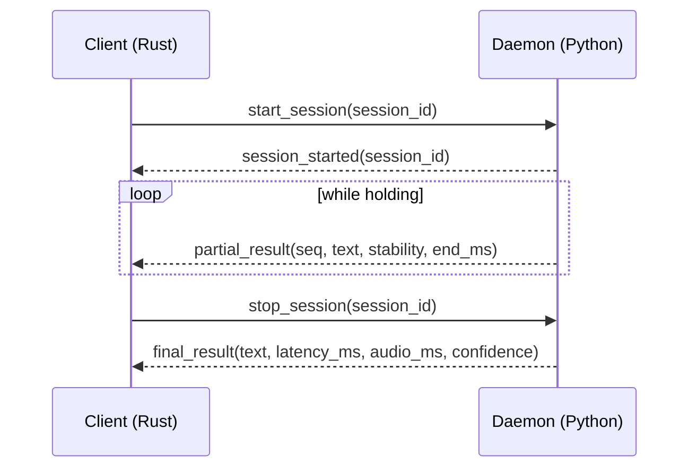

# Streaming vs Offline Speech-to-Text Tradeoffs for UX and MLOps in Parakeet STT

## Executive summary

Your current tool is already a strong “local dictation appliance”: a **Rust push‑to‑talk client** driving a **Python WebSocket daemon** that captures microphone audio and transcribes with **entity["company","NVIDIA","gpu maker"] Parakeet‑TDT 0.6B v3** via NeMo. The repo embodies the right separation of concerns: OS/UX integration in Rust, model/inference in Python. filecitehttps://github.com/SystemicVoid/parakeet-stt/blob/main/parakeet-stt-daemon/src/parakeet_stt_daemon/server.pyL1-L78 filecitehttps://github.com/SystemicVoid/parakeet-stt/blob/main/parakeet-stt-daemon/pyproject.tomlL5-L31

The most important practical finding is that—despite having a “streaming” code path—the **user-facing protocol currently emits only a single `final_result`** (no partial/interim hypotheses). That means the UX behaves like “offline / end-of-utterance” dictation: **time-to-first-text is bounded by release → inference → injection**, and “flicker” / revision doesn’t exist because partials don’t exist yet. filecitehttps://github.com/SystemicVoid/parakeet-stt/blob/main/parakeet-stt-daemon/src/parakeet_stt_daemon/messages.pyL23-L90 filecitehttps://github.com/SystemicVoid/parakeet-stt/blob/main/parakeet-stt-daemon/src/parakeet_stt_daemon/server.pyL187-L259

From a systems/MLOps perspective, you already track several “right” primitives: per-session audio duration, inference time, send time, and a `/status` endpoint that reports runtime truth (requested vs effective device, streaming status, and last timings). filecitehttps://github.com/SystemicVoid/parakeet-stt/blob/main/parakeet-stt-daemon/src/parakeet_stt_daemon/server.pyL277-L336 filecitehttps://github.com/SystemicVoid/parakeet-stt/blob/main/parakeet-stt-daemon/src/parakeet_stt_daemon/server.pyL463-L499

The main opportunity is to evolve into a **hybrid “stream → seal” pipeline**:

- **Stream**: emit partials quickly for user feedback (and to enable “ready-to-release” cues), with a stabilisation policy to minimise revision/flicker.
- **Seal**: at end-of-utterance, produce the best final text (possibly with a higher-latency decode path or second-pass post-processing).

This hybrid approach is consistent with established multi-stage ASR designs where **low-latency streaming hypotheses are refined by a higher-quality pass**; research shows methods like partial rewriting can reduce flicker while improving streaming text quality. citeturn7search7 citeturn7search9

The rest of the report details (a) what the repo does today, (b) streaming vs offline tradeoffs that matter to users, and (c) a concrete improvement roadmap including dashboards, API policies, and benchmark/runbooks.

## Repo audit

### Current architecture and control plane

The daemon is a **FastAPI** server with:

- WebSocket endpoint (`/ws`) for control messages (`start_session`, `stop_session`, `abort_session`). filecitehttps://github.com/SystemicVoid/parakeet-stt/blob/main/parakeet-stt-daemon/src/parakeet_stt_daemon/server.pyL83-L149
- Optional shared-secret authentication via `x-parakeet-secret` header. filecitehttps://github.com/SystemicVoid/parakeet-stt/blob/main/parakeet-stt-daemon/src/parakeet_stt_daemon/server.pyL87-L97
- HTTP endpoints `/healthz` and (if enabled) `/status`. filecitehttps://github.com/SystemicVoid/parakeet-stt/blob/main/parakeet-stt-daemon/src/parakeet_stt_daemon/server.pyL477-L499

The session model is intentionally simple: a **single active session** guarded by an async lock. This reduces failure surface and makes correctness easier, at the cost of concurrency. filecitehttps://github.com/SystemicVoid/parakeet-stt/blob/main/parakeet-stt-daemon/src/parakeet_stt_daemon/session.pyL47-L76

This single-session choice is aligned with a “single desktop user dictation” product, but it strongly shapes streaming vs offline operational tradeoffs: “streaming” is easier to implement when you only ever have one stream to manage; “offline” can be trivially queued/batched for throughput once you scale to multiple users.

### Audio capture, pre-roll, and endpointing equivalents

Audio capture uses `sounddevice.InputStream` feeding a rolling ring buffer plus session accumulation:

- **16 kHz mono** configured in the daemon. filecitehttps://github.com/SystemicVoid/parakeet-stt/blob/main/parakeet-stt-daemon/src/parakeet_stt_daemon/server.pyL52-L63
- **Pre-roll** defaults to **2.5 seconds**, so pressing the hotkey includes a little “just before you pressed” audio (crucial for natural dictation). filecitehttps://github.com/SystemicVoid/parakeet-stt/blob/main/parakeet-stt-daemon/src/parakeet_stt_daemon/audio.pyL18-L37 filecitehttps://github.com/SystemicVoid/parakeet-stt/blob/main/parakeet-stt-daemon/src/parakeet_stt_daemon/audio.pyL70-L93
- The daemon adds a **250 ms post-roll** after `stop_session` to capture tail audio. filecitehttps://github.com/SystemicVoid/parakeet-stt/blob/main/parakeet-stt-daemon/src/parakeet_stt_daemon/server.pyL187-L203

You also apply a tail-silence trim based on RMS dB in a 50 ms window, controlled by `silence_floor_db`. This is a lightweight “endpointing-ish” heuristic (not a real VAD), and it can both help and hurt:

- Helps by removing trailing noise and reducing compute.
- Hurts by potentially clipping quiet endings (e.g., soft consonants or trailing syllables). filecitehttps://github.com/SystemicVoid/parakeet-stt/blob/main/parakeet-stt-daemon/src/parakeet_stt_daemon/server.pyL429-L462 filecitehttps://github.com/SystemicVoid/parakeet-stt/blob/main/parakeet-stt-daemon/src/parakeet_stt_daemon/config.pyL56-L62

### Supported model and decoder implications

The daemon loads **`nvidia/parakeet-tdt-0.6b-v3`** by default. filecitehttps://github.com/SystemicVoid/parakeet-stt/blob/main/parakeet-stt-daemon/src/parakeet_stt_daemon/model.pyL18-L27

From the model card, this model is a **FastConformer‑TDT** transducer model (~600M parameters) and supports multilingual transcription (25 European languages), auto language detection, punctuation/capitalisation, and timestamps in its standard NeMo outputs. citeturn1search0

Two operationally important notes from the model card:

- Long-form behaviour may require attention-mode changes (the card explicitly demonstrates switching to a local attention mode with `rel_pos_local_attn` and `att_context_size=[256,256]`). citeturn1search2
- NVIDIA provides a NeMo streaming inference script and parameters (e.g., `chunk_secs`, `left_context_secs`, `right_context_secs`, `batch_size`) for Parakeet streaming. citeturn1search7

The repo mirrors that guidance in two ways:

- It applies the `change_attention_model(... rel_pos_local_attn ...)` tweak if available. filecitehttps://github.com/SystemicVoid/parakeet-stt/blob/main/parakeet-stt-daemon/src/parakeet_stt_daemon/model.pyL82-L90
- It exposes streaming chunk parameters (`chunk_secs=2`, `right_context_secs=2`, `left_context_secs=10`, `batch_size=32`) as settings. filecitehttps://github.com/SystemicVoid/parakeet-stt/blob/main/parakeet-stt-daemon/src/parakeet_stt_daemon/config.pyL35-L56

The repo does **not** explicitly configure decoding strategy (beam search vs greedy) or external language models, so you should assume whatever NeMo defaults to for `ASRModel.transcribe()` unless you wire it explicitly. filecitehttps://github.com/SystemicVoid/parakeet-stt/blob/main/parakeet-stt-daemon/src/parakeet_stt_daemon/model.pyL118-L141

### What “streaming” currently means in this repo

At the code level, “streaming enabled” means:

- Audio is sliced into fixed chunks and staged in memory (`AudioInput.configure_stream_chunk_size`, `take_stream_chunks`). filecitehttps://github.com/SystemicVoid/parakeet-stt/blob/main/parakeet-stt-daemon/src/parakeet_stt_daemon/audio.pyL123-L179
- A drain loop runs every 50 ms, feeding chunks into a `ParakeetStreamingSession`. filecitehttps://github.com/SystemicVoid/parakeet-stt/blob/main/parakeet-stt-daemon/src/parakeet_stt_daemon/server.pyL404-L421
- The “streaming session” as implemented **accumulates chunks** and then calls a helper transcribe at finalisation time. filecitehttps://github.com/SystemicVoid/parakeet-stt/blob/main/parakeet-stt-daemon/src/parakeet_stt_daemon/model.pyL136-L176

The helper uses `FrameBatchChunkedRNNT` and `AudioFeatureIterator` from NeMo streaming utilities when available, otherwise falls back to offline transcription. filecitehttps://github.com/SystemicVoid/parakeet-stt/blob/main/parakeet-stt-daemon/src/parakeet_stt_daemon/model.pyL192-L241

Crucially for UX, the protocol layer only defines `final_result` (and no `partial_result`). filecitehttps://github.com/SystemicVoid/parakeet-stt/blob/main/parakeet-stt-daemon/src/parakeet_stt_daemon/messages.pyL23-L99

So the “streaming path” today primarily offers **in-process chunked inference/finalisation** (and possibly reduced temp-file IO) but not “live words while you speak”.

### Latency metrics, confidence, and state reporting

The daemon currently reports:

- `latency_ms` and `audio_ms` in `final_result`. filecitehttps://github.com/SystemicVoid/parakeet-stt/blob/main/parakeet-stt-daemon/src/parakeet_stt_daemon/messages.pyL72-L90
- It calculates `infer_ms` and `send_ms` and logs them per session. filecitehttps://github.com/SystemicVoid/parakeet-stt/blob/main/parakeet-stt-daemon/src/parakeet_stt_daemon/server.pyL210-L269
- `/status` includes state, device/effective_device, streaming flags, and last timings. filecitehttps://github.com/SystemicVoid/parakeet-stt/blob/main/parakeet-stt-daemon/src/parakeet_stt_daemon/messages.pyL104-L136 filecitehttps://github.com/SystemicVoid/parakeet-stt/blob/main/parakeet-stt-daemon/src/parakeet_stt_daemon/server.pyL277-L336
- The *protocol* includes `confidence`, but the daemon currently sets it to `None` on final results. filecitehttps://github.com/SystemicVoid/parakeet-stt/blob/main/parakeet-stt-daemon/src/parakeet_stt_daemon/messages.pyL78-L90 filecitehttps://github.com/SystemicVoid/parakeet-stt/blob/main/parakeet-stt-daemon/src/parakeet_stt_daemon/server.pyL224-L234

This matters because “confidence” is one of the strongest levers for UX: confidence drives whether you auto-insert text, ask for correction, or “soft commit” in a UI. Right now, you have the schema hook but not the actual signal.

### Rust client integration surface

The Rust client is explicitly a push-to-talk client for the daemon. filecitehttps://github.com/SystemicVoid/parakeet-stt/blob/main/parakeet-ptt/Cargo.tomlL1-L26

From dependencies alone, you can infer the main integration patterns:

- WebSocket connectivity (`tokio-tungstenite`)
- Hotkey capture (`evdev`)
- Wayland related integration (`wayland-client`, `cosmic-protocols`) filecitehttps://github.com/SystemicVoid/parakeet-stt/blob/main/parakeet-ptt/Cargo.tomlL12-L26

## Streaming vs offline vs hybrid tradeoffs

The tradeoffs that matter most to users are **responsiveness**, **perceived correctness**, and **predictability**. The tradeoffs that matter most to systems/MLOps are **statefulness**, **scheduling/batching**, and **observability of tail risks**.

### Comparative table

| Dimension | Streaming | Offline transcription | Hybrid stream → seal |
|---|---|---|---|
| UX | Lowest *time-to-first-text* when partials are exposed; enables “listening…” feedback and mid-utterance cues. Risk: flicker/revisions unless stabilised. citeturn7search2turn7search3 | Simple mental model: nothing appears until finished. Predictable, minimal flicker (none). Risk: feels “laggy” for long utterances; harder to know if system is working until the end. citeturn3search10 | Best of both: low-latency partial feedback + high-quality final. Requires careful UI to avoid the “typing hallucination effect” (rapid rewrites). Multi-stage merging can reduce flicker. citeturn7search7 |
| Accuracy | Often lower for equal compute because of limited right-context / endpoint uncertainty; streaming architectures address this but tradeoffs remain. citeturn0search5 | Highest, because you can use full utterance context and heavier decoding. Whisper’s canonical use (30s chunks) is offline-style and benefits from full-window context. citeturn3search10 | Near-offline accuracy is achievable with an explicit “seal” pass; hybrid models and multi-stage systems are common in low-latency production ASR. citeturn7search9turn7search7 |
| Cost and compute efficiency | More overhead per audio second if you do many small decode steps; can be offset by caching / streaming-optimised kernels. For multi-tenant services, small-chunk compute can be less GPU-efficient than batched offline. citeturn0search10turn5search6 | Best throughput via batching for multi-tenant workloads; easiest to saturate GPU by batching utterances and running large kernels. citeturn0search10 | Highest raw cost if you naïvely run two full passes; can be contained by (a) running seal only when needed, (b) using lightweight rewriting instead of a full second model, or (c) prefetching downstream steps. citeturn7search7turn7search9 |
| Ops complexity | Highest: stateful sessions, backpressure, endpointing, partial result lifecycle, reconnections. Needs strong instrumentation. citeturn4search2 | Lowest: can be mostly stateless request/response; easiest to scale and test. | Medium-high: combines streaming state + finalisation jobs + reconciliation logic. |
| Privacy and compliance | Privacy depends on deployment; streaming often implies always-on mic capture (even if local), so retention and explicit user signals matter. VAD/endpointing increases “continuous listening” risk perception. citeturn2search9turn2search1 | Often easier to reason about (explicit start/stop), especially for local-only dictation. | Similar to streaming; must clearly signal “listening” vs “processing” and ensure retention policies are explicit. |

Two concrete observations for your repo:

- Because the protocol only emits `final_result`, your current UX is functionally in the **offline bucket**, even if the daemon uses chunked helpers internally. filecitehttps://github.com/SystemicVoid/parakeet-stt/blob/main/parakeet-stt-daemon/src/parakeet_stt_daemon/messages.pyL23-L99
- Your current push-to-talk framing already simplifies endpointing and privacy perception (users *choose* the capture window), which is a major advantage over always-on streaming assistants.

image_group{"layout":"carousel","aspect_ratio":"16:9","query":["streaming speech recognition architecture diagram partial and final results","speech-to-text interim results stability flicker diagram","voice activity detection waveform speech segments diagram"],"num_per_query":1}

### Endpointing and VAD: why users care more than we think

Even in push-to-talk, endpointing influences:

- Tail truncation (“did it cut off my last word?”)
- Latency (“why does it take a beat after I release?”)
- Trust (“is it still listening?”)

Your current approach is “PTT + post-roll + silence trim”, which is pragmatic but can behave non-intuitively on quiet endings. filecitehttps://github.com/SystemicVoid/parakeet-stt/blob/main/parakeet-stt-daemon/src/parakeet_stt_daemon/server.pyL187-L203 filecitehttps://github.com/SystemicVoid/parakeet-stt/blob/main/parakeet-stt-daemon/src/parakeet_stt_daemon/server.pyL429-L462

If you introduce optional “hands-free” or “auto-stop” modes, then adopting a standard VAD becomes important:

- WebRTC VAD has clear constraints (10/20/30 ms frames, modes 0–3 aggressiveness, fixed sample rates) and is extremely fast. citeturn2search9
- Silero VAD is lightweight and popular, with explicit claims about speed and portability (Torch/ONNX). citeturn2search1

## UX patterns and hybrid stream → seal design

This section focuses on what changes once you add partials, and how to avoid the “seizure mode subtitles” experience.

### UX primitives that matter for dictation

If you ship true streaming partials, *users will judge you on these*:

- **Time-to-first-text (TTFT)**: time from hotkey down to first visible token.
- **Time-to-final**: time from hotkey up to final insertion (your current primary KPI).
- **Revision rate**: how often already-shown text changes after being displayed.
- **Flicker magnitude**: size of changed span per revision (single word vs whole sentence).
- **False endpoint rate**: whether you finalise too early or clip endings.

Cloud streaming APIs explicitly distinguish interim vs final results and even surface a stability score (probability the interim won’t change), which is exactly the UX lever you need to tune flicker. citeturn7search2turn7search3

### Stream → seal reference pipeline

A practical architecture for your tool:

- Path A (stream): low latency partials (may revise), show in overlay/TUI only while holding, never injected automatically.
- Path B (seal): final decode on release; inject once.

A multi-stage approach can also merge better streaming text without extra latency; partial rewriting is explicitly proposed to reduce flicker while improving streaming output quality in multi-stage ASR. citeturn7search7

Mermaid flowchart for a recommended stream→seal pipeline:

```mermaid
flowchart TD
  A[Hotkey DOWN / StartSession] --> B[Mic capture + pre-roll]
  B --> C[VAD / endpointing heuristics]
  C --> D[Streaming ASR decode loop]
  D --> E[Partial hypotheses]
  E --> F[Stabilisation policy]
  F --> G[UI preview (non-injected)]
  A2[Hotkey UP / StopSession] --> H[Flush tail + seal trigger]
  H --> I[Final ASR pass (seal)]
  I --> J[Post-processing: ITN / punctuation fixups / custom corrections]
  J --> K[Confidence scoring + safety gates]
  K --> L[Inject (paste/copy-only)]
  L --> M[Metrics + logs + trace spans]
```

### Stabilisation policy: a concrete, implementable recipe

A robust stabilisation policy is usually **token-based** rather than character-based:

- Maintain `committed_prefix` (stable) and `pending_suffix` (unstable).
- On each partial, compute LCP (longest common prefix) against previous partial tokens.
- Commit tokens when they have been unchanged for at least:
  - `N` consecutive partial updates, **or**
  - `T` milliseconds, **or**
  - the model/provider reports `stability >= threshold` (if you add a stability surrogate).

A minimal pseudocode example (client-side) that avoids violent flicker:

```python
def update_transcript(partial_tokens, now_ms):
    global last_tokens, last_change_ms, committed_len

    lcp = longest_common_prefix(last_tokens, partial_tokens)

    # If the hypothesis changed before the committed boundary, don't roll back;
    # keep committed stable and only let suffix revise.
    lcp = max(lcp, committed_len)

    if lcp < len(last_tokens):
        last_change_ms = now_ms

    # Commit if suffix has been stable long enough
    if now_ms - last_change_ms > 350:
        committed_len = max(committed_len, lcp)

    committed = partial_tokens[:committed_len]
    pending = partial_tokens[committed_len:]
    last_tokens = partial_tokens

    render(committed, pending)
```

This matches the intent behind “interim vs final” and “stability” fields seen in production streaming APIs. citeturn7search2turn7search3

### Session handling: recommended protocol extensions

Your current protocol already has clean session IDs and lifecycle. filecitehttps://github.com/SystemicVoid/parakeet-stt/blob/main/parakeet-stt-daemon/src/parakeet_stt_daemon/messages.pyL35-L69

To support partials without breaking current clients:

- Add `partial_result` messages (clients ignore unknown types today if implemented defensively).
- Include:
  - `sequence` number (monotonic per session)
  - `text` (or token list)
  - `is_stable`/`stability` (0–1, even if heuristic)
  - `end_ms` (audio offset covered by the hypothesis)
  - `rtf` or compute time so far (for user feedback)

Sequence diagram:



## Observability, scaling patterns, privacy and compliance

### Observability: what you have and what to add

Today you have three excellent starting points:

1. **Per-session timings** (`audio_ms`, `infer_ms`, `send_ms`) logged at completion. filecitehttps://github.com/SystemicVoid/parakeet-stt/blob/main/parakeet-stt-daemon/src/parakeet_stt_daemon/server.pyL210-L269  
2. A `/status` endpoint with runtime truth fields and last timings. filecitehttps://github.com/SystemicVoid/parakeet-stt/blob/main/parakeet-stt-daemon/src/parakeet_stt_daemon/server.pyL277-L336  
3. Explicit tracking of streaming helper activation and fallback reason. filecitehttps://github.com/SystemicVoid/parakeet-stt/blob/main/parakeet-stt-daemon/src/parakeet_stt_daemon/model.pyL192-L241

To make this “MLOps-grade” (even for a local single-user app), add two layers:

- **Metrics**: Prometheus-style counters/histograms (or OTEL metrics exporter).
- **Tracing**: spans per session stage (capture, chunking, decode, postprocess, inject).

OpenTelemetry defines traces as DAGs of spans across components, which is a good mental model for your stream→seal pipeline. citeturn4search2turn4search5

Recommended spans (session_id as trace_id or trace attribute):

- `stt.session` (root)
  - `audio.capture` (time holding + buffer stats)
  - `asr.stream.decode` (if streaming enabled)
  - `asr.seal.decode` (final pass)
  - `postprocess.itn`
  - `inject.clipboard`
  - `inject.paste_chord`

### Scaling patterns for “desktop now, service later”

Even if you’re desktop-only today, designing the interface and metrics as if you’ll scale later pays off.

Key distinction:

- **Streaming** is **stateful** per session. Scaling requires concurrency control and GPU scheduling for many simultaneous sessions.
- **Offline** is **stateless-ish** request/response. Scaling is mostly queueing and batching.

NVIDIA’s deployment ecosystem for ASR explicitly distinguishes inference modes including streaming low latency, streaming high throughput, and offline. That matches the operational reality that streaming and offline are optimised differently. citeturn0search10

Concrete scaling pattern recommendations:

- For offline batch: queue utterances and micro-batch to maximise GPU utilisation.
- For streaming multi-user: shard sessions and keep per-session cache/state on a worker; careful admission control (max concurrent sessions per GPU).
- Consider a “str-thr” style mode (streaming high throughput) if you ever host multiple users, where you accept slightly higher latency to enable chunk batching. citeturn0search10

### Privacy and compliance considerations

You’re already “privacy-first by architecture” when deployed locally:

- The daemon binds to localhost by default and offers an optional shared secret. filecitehttps://github.com/SystemicVoid/parakeet-stt/blob/main/parakeet-stt-daemon/src/parakeet_stt_daemon/config.pyL12-L36 filecitehttps://github.com/SystemicVoid/parakeet-stt/blob/main/parakeet-stt-daemon/src/parakeet_stt_daemon/server.pyL87-L97
- Audio stays in-process; only control messages traverse WebSocket. filecitehttps://github.com/SystemicVoid/parakeet-stt/blob/main/parakeet-stt-daemon/src/parakeet_stt_daemon/server.pyL381-L414

Still, two privacy issues remain *even locally*:

- **Retention**: temp WAVs (offline fallback) and logs can constitute personal data. You currently write temp files in offline fallback; ensure they are deleted (you do unlink), and consider adding a “never write audio” toggle (force in-memory). filecitehttps://github.com/SystemicVoid/parakeet-stt/blob/main/parakeet-stt-daemon/src/parakeet_stt_daemon/server.pyL396-L403
- **Always-on perception**: if you add VAD auto-stop/auto-start later, you must provide explicit user feedback about listening state. (This is why TTFT cues and state indicators are not “nice-to-have”; they are trust infrastructure.)

The model card for Parakeet also discusses intended use, limitations, and privacy posture (e.g., no “generatable personal data” claimed and dataset provenance notes), which is useful context if you ever distribute the tool. citeturn1search0

### Concrete MLOps runbooks

These are designed so you can hand them to “future Hugo” (sleep-deprived) and still get a deterministic outcome.

**Runbook: daemon won’t start / model won’t load**
- Symptom: startup fails or inference errors.
- Checks:
  - Confirm NeMo ASR dependency exists in daemon environment. filecitehttps://github.com/SystemicVoid/parakeet-stt/blob/main/parakeet-stt-daemon/pyproject.tomlL11-L31
  - If `cuda` requested, confirm GPU is actually used; your code records `_requested_device` vs `_effective_device` and logs runtime truth. filecitehttps://github.com/SystemicVoid/parakeet-stt/blob/main/parakeet-stt-daemon/src/parakeet_stt_daemon/server.pyL463-L474
  - Differentiate “streaming enabled” vs “streaming helper active” via `/status`. filecitehttps://github.com/SystemicVoid/parakeet-stt/blob/main/parakeet-stt-daemon/src/parakeet_stt_daemon/server.pyL277-L336

**Runbook: clipping / truncation complaints**
- Symptom: last word chopped, or users compensate by pausing.
- Checks:
  - Inspect `silence_floor_db` and tail trimming behaviour. filecitehttps://github.com/SystemicVoid/parakeet-stt/blob/main/parakeet-stt-daemon/src/parakeet_stt_daemon/server.pyL429-L462
  - Verify post-roll is not effectively excluded from your latency KPI; latency is measured after `stop_session` marks processing, which happens after the 250 ms sleep. This is correct, but it can hide perceived latency from your logs unless you also track “key up → inject” end-to-end. filecitehttps://github.com/SystemicVoid/parakeet-stt/blob/main/parakeet-stt-daemon/src/parakeet_stt_daemon/server.pyL187-L203 filecitehttps://github.com/SystemicVoid/parakeet-stt/blob/main/parakeet-stt-daemon/src/parakeet_stt_daemon/session.pyL62-L71
- Mitigation:
  - Add VAD-based endpointing for tail rather than RMS-only trimming (see tests section). citeturn2search9turn2search1

**Runbook: “it feels laggy”**
- Symptom: users release hotkey and wait.
- Checks:
  - Collect p50/p95/p99 for end-to-end “release → injected” (not just inference).
  - If adding partials later, ensure TTFT < 200 ms; otherwise the “streaming” value proposition is lost.

**Runbook: streaming-quality regression**
- Symptom: streaming mode is active but accuracy is worse than offline.
- Checks:
  - Validate chunk parameter selection; Parakeet guidance uses right/left context and chunk sizes explicitly. citeturn1search7
  - Consider multi-latency training or cache-aware streaming designs when you upgrade architectures (published approaches exist). citeturn5search6turn0search5

## Roadmap, metrics and benchmarks

### Prioritised roadmap of repo/tool improvements

Effort is relative to your codebase (low ≈ <1 day, med ≈ 2–7 days, high ≈ multi-week including eval/tuning).

| Priority | Improvement | Effort | Impact | Implementation notes |
|---|---|---|---|---|
| High | Add `partial_result` protocol + client rendering (no injection) | High | High | Extend message schema beyond `final_result` (backward compatible). Implement stabilisation policy to prevent flicker. Ground UX in interim/final patterns and stability notion. citeturn7search2turn7search3 |
| High | Implement stream→seal architecture | High | High | Keep streaming partials while holding, then run a “seal” pass on release. Consider lightweight partial rewriting to reduce flicker and improve streaming text quality without retraining. citeturn7search7turn7search9 |
| High | End-to-end latency metric: “key up → injected” | Med | High | Today you log infer/send, but injection is on the Rust side. Add correlation (session_id) and track end-to-end percentiles. Use OTEL spans across components. citeturn4search2 |
| High | Real VAD option (WebRTC or Silero) for tail and optional auto-stop | Med | High | Replace/augment RMS tail trim with VAD decisions; keep push-to-talk as default. WebRTC VAD constraints and modes are well-defined; Silero VAD is easy to integrate. citeturn2search9turn2search1 |
| High | Confidence scoring | Med | High | You already expose `confidence` but send `None`. Define what confidence means: posterior of top hypothesis, stability proxy, or calibrated correctness. Start with heuristic confidence (e.g., logprob-derived) and later calibrate on dev set. filecitehttps://github.com/SystemicVoid/parakeet-stt/blob/main/parakeet-stt-daemon/src/parakeet_stt_daemon/server.pyL224-L234 |
| Medium | Add Prometheus `/metrics` + structured event logs | Med | High | Convert per-session logs into counters/histograms; track fallback reasons, audio device errors, session_busy, trim ratio. Keep `/status` for humans, `/metrics` for dashboards. citeturn4search2turn4search5 |
| Medium | Multi-session support + admission control | High | Med | Today SessionManager enforces single active session. If you ever want background dictation + file jobs, add job queue and GPU scheduler. filecitehttps://github.com/SystemicVoid/parakeet-stt/blob/main/parakeet-stt-daemon/src/parakeet_stt_daemon/session.pyL47-L76 |
| Medium | Add offline file transcription endpoint | Med | Med | Expose HTTP endpoint or CLI to send a WAV/FLAC and return text; this enables benchmarking and “batch mode” testing using the same service. Parakeet supports WAV/FLAC 16k mono expectations. citeturn1search0 |
| Medium | Post-processing pipeline: deterministic corrections + ITN hooks | Med | Med | Keep it deterministic (avoid LLM hallucinations). Start with user dictionary / phrase replacement layer; measure impact on WER and user edits. |
| Medium | Optional diarisation for meetings | High | Med | Integrate diarisation only for offline mode initially (compute-heavy). pyannote pipelines are a common choice but require HF model access and licensing considerations. citeturn2search14turn2search16 |
| Low | GPU memory reporting in `/status` | Low | Low-Med | `gpu_mem_mb` is always `None` today; populate from CUDA runtime when available for quicker diagnostics. filecitehttps://github.com/SystemicVoid/parakeet-stt/blob/main/parakeet-stt-daemon/src/parakeet_stt_daemon/server.pyL277-L336 |
| Low | Config audit: make streaming “truth” explicit everywhere | Low | Med | You already track `stream_helper_active` and fallback reason; ensure the client UI reflects it so users don’t assume partials exist when they don’t. filecitehttps://github.com/SystemicVoid/parakeet-stt/blob/main/parakeet-stt-daemon/src/parakeet_stt_daemon/model.pyL192-L241 |

### Suggested metrics and dashboards

A good metrics set should answer: “Is it fast?”, “Is it right?”, “Is it stable?”, “Is it safe/private?”, “Is it getting worse?”

**Core metrics**

- Latency histograms (p50/p95/p99):
  - `stt.stop_to_final_ms` (daemon side)
  - `stt.keyup_to_inject_ms` (end-to-end)
- Audio duration distribution:
  - `stt.audio_ms`
- Streaming health:
  - `stt.streaming_enabled` (gauge)
  - `stt.stream_helper_active_ratio` (rate)
  - `stt.stream_fallback_reason_total{reason=...}` (counter)
- Quality proxies:
  - `stt.confidence` distribution (once implemented)
  - `stt.user_corrections_per_100_words` (if you add a correction loop)
- Endpointing/VAD:
  - `stt.trimmed_tail_ms` and `stt.trim_ratio`
  - `stt.vad_false_end_total` (derived from user behaviour or tests)
- Reliability:
  - `stt.session_busy_total`
  - `stt.audio_device_error_total`
  - `stt.model_error_total`
  - `stt.ws_disconnect_total`

**Dashboard chart types**

- Time-series line charts:
  - p95 end-to-end latency over time
  - stream fallback rate over time
- Histogram / heatmap:
  - latency histogram (bucketed)
  - audio length vs latency scatter/heatmap (reveals RTF drift)
- Table panels:
  - top fallback reasons
  - top error codes
- “Single number” KPI tiles:
  - TTFT p95 (once partials exist)
  - injection success rate

### Recommended tests and benchmarks

The goal is to stop guessing. You want reproducible measurements for both **WER** and **latency** under controlled conditions.

**Datasets (recommended)**
- English accuracy: LibriSpeech test-clean / test-other (standard baseline; also referenced in Parakeet training lineage). citeturn1search0turn0search5
- Multilingual sanity: FLEURS (explicitly used in Parakeet evaluation). citeturn1search0
- Noisy speech: MUSAN noise mixing is referenced in model card context; use a noise-mixed eval set for robustness checks. citeturn1search0
- Diarisation (if you implement): AMI/meeting-style corpora are common; benchmark diarisation separately from ASR.

**Latency targets (recommended, not measured here)**
- For “dictation feels instant”, aim for:
  - **Key up → injected**: p50 ≤ 120 ms, p95 ≤ 250 ms, p99 ≤ 500 ms on typical 1–5 s utterances.
  - **TTFT** (if partials): p95 ≤ 250 ms (otherwise partials aren’t worth the complexity).

**WER targets (recommended, model-dependent)**
- Track WER relative to Parakeet published benchmarks where relevant, but keep a local baseline specific to your microphone and noise environment. The model card reports multilingual WER benchmarks and notes evaluations omit punctuation/capitalisation errors by stripping them. citeturn1search0

**Benchmark harness design**
- Offline benchmark:
  - input WAV/FLAC files
  - output transcript + WER + runtime
  - measure RTF (compute/audio)
- Streaming-simulated benchmark:
  - feed audio in real time (or accelerated) with the same chunk sizes you will use in production
  - measure:
    - TTFT
    - revision rate / flicker score
    - final WER
- Injection benchmark:
  - synthetic “final result” events
  - measure clipboard write + paste chord time and error rate per target app

**Synthetic failure injections (must-have)**
- WebSocket disconnect mid-session (ensure cleanup and no leaked capture state). Your daemon already has cleanup paths; keep regression tests. filecitehttps://github.com/SystemicVoid/parakeet-stt/blob/main/parakeet-stt-daemon/src/parakeet_stt_daemon/server.pyL150-L179
- Audio device returns empty / drops frames (assert explicit error and recovery).
- Force streaming helper unavailability (e.g., missing import) and verify:
  - `/status` shows fallback reason
  - final results still work via offline path. filecitehttps://github.com/SystemicVoid/parakeet-stt/blob/main/parakeet-stt-daemon/src/parakeet_stt_daemon/model.pyL192-L241
- GPU unavailable → device resolves to CPU and is reflected in “runtime truth”. filecitehttps://github.com/SystemicVoid/parakeet-stt/blob/main/parakeet-stt-daemon/src/parakeet_stt_daemon/model.pyL29-L76 filecitehttps://github.com/SystemicVoid/parakeet-stt/blob/main/parakeet-stt-daemon/src/parakeet_stt_daemon/server.pyL463-L474

## Assumptions and explicitly unknown items

- I did not assume any specific NeMo decoding settings (beam size, LM rescoring, timestamp extraction) beyond what is visible in the repo; the current daemon extracts only `.text` and does not expose timestamps. filecitehttps://github.com/SystemicVoid/parakeet-stt/blob/main/parakeet-stt-daemon/src/parakeet_stt_daemon/model.pyL44-L57
- I did not assume measured latency/quality numbers for your workstation beyond what your code logs; the report’s latency/WER targets are recommendations to benchmark against, not claims about current performance.
- The repo’s “streaming” path is described exactly as implemented (chunk accumulation + finalisation); I did not assume incremental partial decode output because the message schema lacks `partial_result`. filecitehttps://github.com/SystemicVoid/parakeet-stt/blob/main/parakeet-stt-daemon/src/parakeet_stt_daemon/messages.pyL23-L99